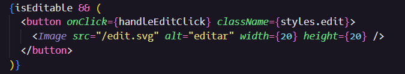

  <h1>SVG ou PNG</h1>  
  

É mais apropriado optar por ícones no formato SVG ou PNG ao formatar elementos em websites?

 

### Razões para o SVG ser uma boa escolha:

- Oferece suporte fluido em navegadores de todas as dimensões, tornando a experiência mais leve, por ser um vetor.
- Facilita a escalabilidade para cima ou para baixo, permitindo efeitos de hover.
- Possibilita a incorporação e modificação em tempo real de SVGs utilizando JavaScript.
- Permite estilizar SVGs ou suas partes utilizando CSS, como alteração de cores e contornos.
- Capacita a geração dinâmica de SVGs tanto no cliente quanto no servidor. Sua estrutura baseada em texto elimina a necessidade de bibliotecas de baixo nível ou servidores robustos para sua criação.

### Razões para o PNG ser uma boa escolha:

- Aprimorado suporte em todos os navegadores.
- Ferramentas já disponíveis para a criação de spritesheets em formato PNG.
- A maioria dos usuários possui um editor compatível com o formato PNG em seus computadores.
- Ideal para imagens como fotografias ou outros tipos difíceis de vetorizar.

 

<h2 align="center">Exemplos de SVG e PNG</h2>

Logo em SVG (com zoom):

Logo em PNG (com zoom):

<h2 align="center">Formas de Implementar SVG</h2>

### SVG inline

Implementar o SVG direto no código HTML:

### SVG dentro de uma tag IMG

Salvando o SVG em um arquivo `.svg`:

Implentar ele na tag `img`:

